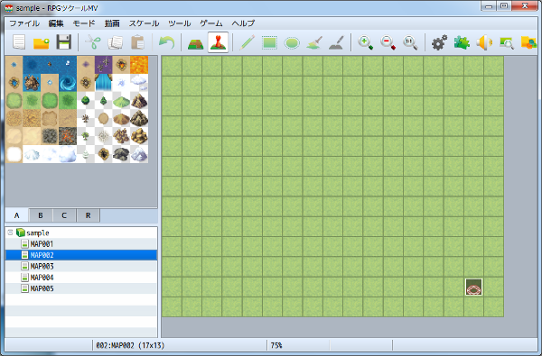
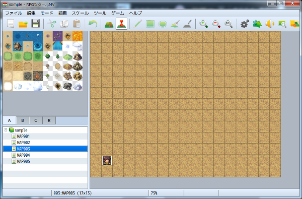
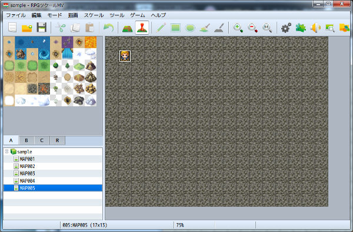

[トップページに戻る](README.md)

# [FTKR_ConnectingMapGenerator](FTKR_ConnectingMapGenerator.js) プラグイン

複数のマップを繋げて１つの大きなマップにするプラグインです。

ダウンロード: [FTKR_ConnectingMapGenerator.js](https://raw.githubusercontent.com/futokoro/RPGMaker/master/FTKR_ConnectingMapGenerator.js)

## 目次

以下の項目の順でプラグインの使い方を説明します。
1. [概要](#概要)
2. [マップを連結する方法](#マップを連結する方法)
2. [連結マップから場所移動する場合](#連結マップから場所移動する場合)
2. [マップを連結させるための条件](#マップを連結させるための条件)
2. [連結後のマップ設定](#連結後のマップ設定)
* [プラグインの更新履歴](#プラグインの更新履歴)
* [ライセンス](#ライセンス)

## 概要

最大４つのマップを繋げて１つの大きなマップとして表示することができます。

連結後のマップでは、各マップに設定したイベントも個々に実行することができます。
ただし、イベントのIDは、連結後のマップでは変わるため注意が必要です。

### 連結前の各マップ








### 連結後のマップ


[目次に戻る](#目次)

## プラグインの登録

このプラグインは、プラグイン管理画面で、一番下になるように登録してください。

[目次に戻る](#目次)

## マップを連結する方法

場所移動コマンド実行前に、以下のプラグインコマンドを実行します。<br>
※[]は実際の入力に使用しません

```
CMG_マップ連結 [マップ1] [マップ2] [マップ3] [マップ4]
CMG_CONNECTING_MAP [map1] [map2] [map3] [map4]
```

#### マップ1(map1)
連結後にマップの左上に配置されるマップのIDを指定します。
連結後のマップ設定は、マップ1の設定を引き継ぎます。

#### マップ2(map2)
連結後にマップの右上に配置されるマップのIDを指定します。

#### マップ3(map3)
連結後にマップの左下に配置されるマップのIDを指定します。

#### マップ4(map4)
連結後にマップの右下に配置されるマップのIDを指定します。


入力例)
```
CMG_マップ連結 2 3 4 5
CMG_CONNECTING_MAP 2 3 4 5
```

マップを２つだけ連結させることも可能です。

横に連結させる場合は、マップ3 と マップ4に 0 を入力します。<br>
縦に連結させる場合は、マップ1 と マップ4に 0 を入力します。

[目次に戻る](#目次)

## 連結マップから場所移動する場合

場所移動する場合は、必ず以下のコマンドを実行してください。

```
CMG_マップ連結解除
CMG_CLEAR_CONNECTING_MAP
```

[目次に戻る](#目次)

## マップを連結させるための条件

連結させるマップ同士は幅や高さを合わせる必要があります。

1. マップ1 と マップ2 の 高さ は同じにしてください。
2. マップ1 と マップ3 の 幅 は同じにしてください。
3. マップ2 と マップ4 の 幅 を同じにしてください。
4. マップ3 と マップ4 の 高さ を同じにしてください。

また、タイルセットはすべてのマップで同じものを使用しなくてはいけません。

[目次に戻る](#目次)

## 連結後のマップ設定

連結後のマップ設定(*1)は、"マップ1"に使用したマップの設定を引き継ぎます。

(*1)引き継ぐマップ設定
* スクロールタイプ
* マップタイル
* 敵出現歩数
* BGM自動演奏
* BGS自動演奏
* 戦闘背景設定
* ダッシュ禁止設定
* 遠景設定
* メモの内容

例えば、以下のコマンドで連結した場合
```
CMG_マップ連結 2 3 4 5
```
連結後のマップ設定は、マップID2と同じです。

以下の設定については連結連結前後で変わるため注意が必要です。

* エンカウント
* イベントID

[目次に戻る](#目次)

### 連結後のマップのエンカウント

連結後のマップのエンカウントは、それぞれのマップで設定したエンカウントの設定を合成したものになります。

例えば、連結前のマップで
* マップ1の全域に敵グループID1
* マップ2の全域に敵グループID2

を設定していた場合は、連結後は
* 連結マップ全域に敵グループID1と敵グループID2

がエンカウントするようになります。


また、リージョンによるエンカウント設定の場合も、同様で例えば、連結前のマップで
* マップ1のリージョン1に敵グループID1
* マップ2のリージョン1に敵グループID2
* マップ3のリージョン2に敵グループID3

を設定していた場合は、連結後は
* 連結マップのリージョン1に敵グループID1と敵グループID2
* 連結マップのリージョン2に敵グループID3

がエンカウントするようになります。

これは、連結前のマップ1でリージョン2に設定していたエリアにも連結後は、敵グループID3が出現するようになる、ということです。

[目次に戻る](#目次)

### 連結後のマップのイベントID

連結後のマップのイベントIDは、以下のスクリプトで取得できます。

```
this.cmgEventId(mapId, eventId)
```
* mapId: そのイベントを作成したマップのID(データベース上のマップです)
* eventIdそのイベントを作成したマップ上のイベントID

入力例)
```
this.cmgEventId(2, 3)
```

ただし、そのイベント内であれば、this._eventId で自分のIDを取得できます。
これは、連結後も変わりません。

[目次に戻る](#目次)

## プラグインの更新履歴

| バージョン | 公開日 | 更新内容 |
| --- | --- | --- |
| [ver1.0.0](FTKR_ConnectingMapGenerator.js) | 2018/04/22 | 初版公開 |

## ライセンス

本プラグインはMITライセンスのもとで公開しています。

[The MIT License (MIT)](https://opensource.org/licenses/mit-license.php)

#
[目次に戻る](#目次)

[トップページに戻る](README.md)